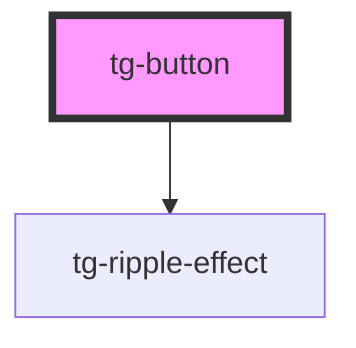

# tg-button

<!-- Auto Generated Below -->

## Properties

| Property     | Attribute  | Description          | Type                             | Default     |
| ------------ | ---------- | -------------------- | -------------------------------- | ----------- |
| `isDisabled` | `disabled` | Sets disabled status | `boolean`                        | `undefined` |
| `size`       | `size`     | Sets button size     | `"large" \| "medium" \| "small"` | `"medium"`  |
| `theme`      | `theme`    | Sets the theme       | `"dark" \| "white" \| "yellow"`  | `"yellow"`  |

## Events

| Event     | Description                                | Type               |
| --------- | ------------------------------------------ | ------------------ |
| `tgClick` | Emitted when the button was clicked.       | `CustomEvent<any>` |
| `tgFocus` | Emitted when the button is focused.        | `CustomEvent<any>` |
| `tgHover` | Emitted when the mouse is over the button. | `CustomEvent<any>` |

## Dependencies

### Depends on

- [tg-ripple-effect](..\ripple-effect)

### Graph

----------------------------------------------

*Built with [StencilJS](https://stenciljs.com/)*
