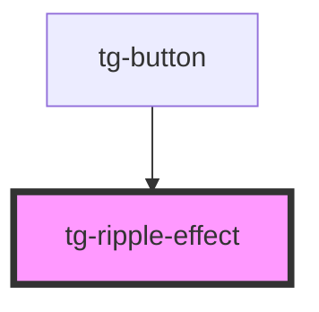

# tg-ripple-effect

<!-- Auto Generated Below -->

## Properties

| Property | Attribute | Description                                                                                                                                                                                                                                                                                                                                                         | Type                       | Default     |
| -------- | --------- | ------------------------------------------------------------------------------------------------------------------------------------------------------------------------------------------------------------------------------------------------------------------------------------------------------------------------------------------------------------------- | -------------------------- | ----------- |
| `type`   | `type`    | Sets the type of ripple-effect:  - `bounded`: the ripple effect expands from the user's click position - `unbounded`: the ripple effect expands from the center of the button and overflows the container.  NOTE: Surfaces for bounded ripples should have the overflow property set to hidden, while surfaces for unbounded ripples should have it set to visible. | `"bounded" \| "unbounded"` | `"bounded"` |

## Methods

### `addRipple(x: number, y: number) => Promise<() => void>`

Adds the ripple effect to the parent element.

#### Returns

Type: `Promise<() => void>`

## Dependencies

### Used by

 - [tg-button](..\button)

### Graph

----------------------------------------------

*Built with [StencilJS](https://stenciljs.com/)*
